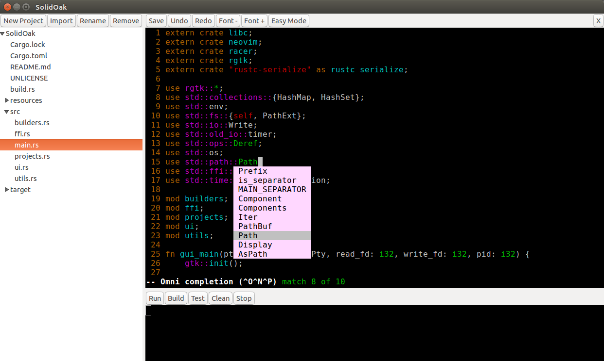

## Introduction

SolidOak is a simple IDE for Rust. See [the website](https://sekao.net/solidoak/) for binary releases. It has the following features:

* An embedded copy of [Neovim](https://github.com/neovim/neovim) as its text editor
    - On first launch, it will create ~/.soak and ~/.soakrc (equivalent to ~/.vim and ~/.vimrc)
    - It starts off in "Easy Mode" (locked in insert mode) for Vim newbies, but you can toggle it off
* An easy-to-use GUI written with [gtk-rs](https://github.com/gtk-rs/gtk)
    - Buttons for common editing actions and a project tree that stays in sync with Neovim
    - You can bypass the GUI and run it as a console app by passing the `-nw` flag
* Autocomplete via [Racer](https://github.com/phildawes/racer)
    - The binary releases come bundled with it, so no configuration is necessary

## Build Instructions

Note: If neovim fails to build, try [cloning it directly](https://github.com/oakes/neovim) and running `make libnvim` to get more specific errors.

### Linux (apt-get)

```Shell
apt-get install libgtk-3-dev libglib2.0-dev libcairo2-dev libvte-2.91-dev
apt-get install libtool autoconf automake cmake libncurses5-dev g++ pkg-config unzip
cargo build --release
```

### Linux (yum)


```Shell
yum install gtk3-devel glib2-devel vte3-devel
yum install autoconf automake cmake gcc gcc-c++ libtool ncurses-devel pkgconfig
cargo build --release
```

### OS X (homebrew)

```Shell
brew install gtk+3
# NOTE: the next line must be run directly in this project, because it is a local file
brew install vte3.rb
brew install libtool automake cmake pkg-config gettext
cargo build --release
```

### OS X (macports)

```Shell
port install gtk3 vte-2.90
port install libtool automake cmake pkgconfig gettext
cargo build --release
```

### Windows is not supported

To support Windows, we would need to get rgtk and neovim-rs to build for it. Additionally, we would need to find a replacement for all the Posix-specific functions being used in `src/ffi.rs`.

## Licensing

All files that originate from this project are dedicated to the public domain. I would love pull requests, and will assume that they are also dedicated to the public domain.
